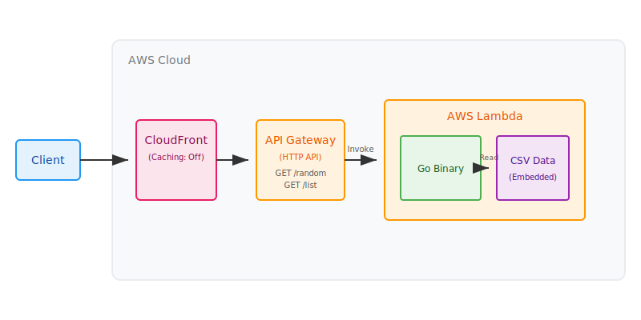

# 北海道の難読地名API

北海道の難読地名をランダムに返すAPIです。

## 開発やローカルでの実行について

ビルド、ローカル実行、AWSへのデプロイ（Terraform）、ツールの使用方法などの開発手順については、[DEVELOPMENT.md](./DEVELOPMENT.md) を参照してください。



## API Routes

> [!NOTE]
> 現在、すべてのエンドポイントは `/v1` プレフィックスをサポートしています。
> 旧来のプレフィックスなしのエンドポイント（例: `/random`）も引き続き利用可能ですが、新しい開発では `/v1` を使用することを推奨します。

### GET /v1/random

ランダムに選ばれた北海道の難読地名とその読みを返します。

**レスポンスサンプル:**
```json
{
  "name": "国縫",
  "yomi": "くんぬい"
}
```

### GET /v1/list

北海道の難読地名とその読みの一覧を返します。

**レスポンスサンプル:**
```json
[
  {
    "name": "足寄",
    "yomi": "あしょろ"
  },
  {
    "name": "神恵内",
    "yomi": "かもえない"
  },
  {
    "name": "国縫",
    "yomi": "くんぬい"
  }
 ]
```

### GET /v1/id/{id}

指定されたIDの北海道の難読地名とその読みを返します。

**レスポンスサンプル:**
```json
{
  "id": 1,
  "name": "足寄",
  "yomi": "あしょろ"
}
```

## プロジェクト構成

```text
.
├── source/          # APIサーバーのソースコード (Go)
│   ├── cmd/api/     # エントリポイント
│   ├── internal/    # 内部ロジック (handler, repository, model)
│   └── data/        # 地名データ (CSV)
├── terraform/       # インフラ定義 (AWS/Terraform)
├── tools/           # 補助ツール (データ生成スクリプト等)
└── architecture.svg # アーキテクチャ図
```
